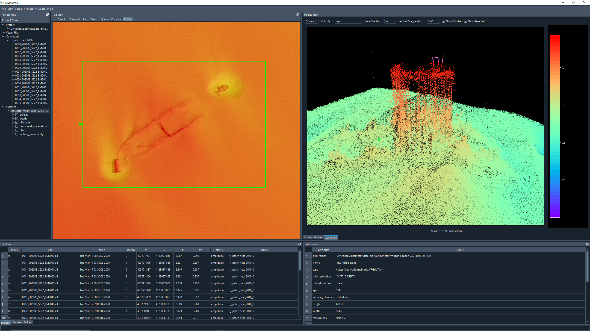
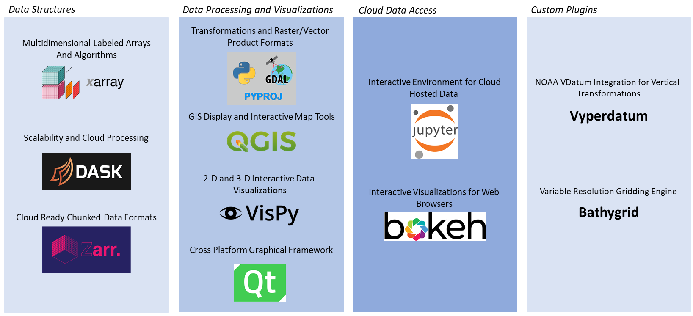

# kluster 

Documentation: [readthedocs](https://kluster.readthedocs.io/en/latest/) 

Youtube Series: [Kluster Playlist](https://www.youtube.com/playlist?list=PLrjCvP_J9AA_memBs2ZyKXGHG1AMx0GWx)

Development Items: [Trello Board](https://trello.com/b/nNZq8S9W)

A distributed multibeam processing system built on the [Pangeo ecosystem](https://pangeo.io/). Supports Kongsberg .all/.kmall multibeam formats, POS MV post-processed SBET/RMS navigation files and Caris svp sound velocity profile files.

Kluster provides a fully open source hydrographic processing package to produce accessible bathymetry products in support of ocean mapping.

Contents
========
 * [Known Issues](#known-issues) 
 * [Kluster is...](#kluster-is)
 * [Why Kluster](#why-kluster)
 * [Installation](#installation)
 * [Quickstart](#quickstart)
 * [Kluster on the console](#kluster-on-the-console)

### Known Issues:
 - Kluster does not support 'multifrequency' as seen in the most recent KMALL logged data.
  
### Kluster is:

1. **Scalable** - uses [Dask](https://dask.org/) to provide distributed parallel processing on everything from a laptop to a cloud service (AWS Fargate for example)
2. **Cloud ready** - uses [Zarr](https://zarr.readthedocs.io/en/stable/) as a cloud ready storage format for converted multibeam records and processed soundings
3. **Open** - data are presented using [Xarray](http://xarray.pydata.org/en/stable/) objects for easy interactivity and stored with Zarr, all open formats
4. **Scriptable** - provides a GUI for visualization and processing, but can be run from the command line or scripted easily
5. **Extensible** - From data conversion to sound velocity correction, kluster is built using modules that can be replaced, enhanced or exchanged as needed.

Kluster has been tested on:

- EM2040/2040c/2040p
- EM2040 dual tx/dual rx
- EM710/712
- EM3002
- EM302/304
- EM122

Kluster is built from the ground up in Python, and was developed using Python 3.8.  Kluster includes modules developed by the hydrographic community such as (see [drivers](https://github.com/noaa-ocs-hydrography/drivers)):

- kmall - Kongsberg kmall file reader
- par3 - Kongsberg .all file reader
- sbet - POSPac sbet/rms file reader

Kluster is a work in progress that has been in development since November 2019 by a small 'team', and is by no means feature complete.  If you are interested in contributing or have questions, please contact Eric Younkin (eric.g.younkin@noaa.gov)

### Why Kluster?

There are three principle motivations behind kluster:

1. ##### Build a multibeam processing sandbox for scientists/engineers

The hydrographic community is continuously innovating.  Oftentimes, we want to experiment with an algorithm or technique, but the data is inaccessible, or relies on intermediate products that are locked within the software.  How do you get attitude corrected beam vectors into a numpy array?  How can I test a new gridding algorithm without exporting soundings to text first?

2. ##### Build a multibeam cloud processing system for field use/production

Cloud data storage and processing is quickly becoming a reality, as the advantages of not owning your own infrastructure become apparent.  Where does this leave processing software and our traditional workflow?  Kluster is designed from the ground up to address this issue, by providing processing that can be tailored and deployed in multiple different ways depending on the application.  In addition, using the multiprocessing capabilities of Dask, kluster provides a powerful tool that can compete with existing software packages in terms of performance.

3. ##### Evaluate the latest in open source scientific software

Much of the existing open source software related to multibeam processing has been in development for decades.  There has been an explosion in scientific libraries that can benefit the hydrographic community as a whole that have not been seriously evaluated.  Kluster relies on the state of the art in Python libraries to provide a sophisticated and modern software package.

### Installation

**We recommend that users try to run Kluster using the release attached to this GitHub repository, see [releases](https://github.com/noaa-ocs-hydrography/kluster/releases)**

Kluster is not on PyPi, but can be installed using pip alongside the HSTB-drivers and HSTB-shared modules that are required.

(For Windows Users) Download and install Visual Studio Build Tools 2019 (If you have not already): [MSVC Build Tools](https://visualstudio.microsoft.com/visual-cpp-build-tools/)

Download and install conda (If you have not already): [conda installation](https://docs.conda.io/projects/conda/en/latest/user-guide/install/)

Download and install git (If you have not already): [git installation](https://git-scm.com/book/en/v2/Getting-Started-Installing-Git)

Some dependencies need to be installed from the conda-forge channel.  I have an example below of how to build this environment using conda.

Perform these in order:

`conda create -n kluster_test python=3.8.12 `

`conda activate kluster_test `

`conda install -c conda-forge qgis=3.18.3 vispy=0.9.4 pyside2=5.13.2 gdal=3.3.1 h5py `

`pip install git+https://github.com/noaa-ocs-hydrography/kluster.git#egg=hstb.kluster `

### Quickstart

See [documentation](https://kluster.readthedocs.io/en/latest/quickstart/index.html)  for the new quick start guide

### Kluster on the console

See examples or notebooks for examples on how to use Kluster in the console. 